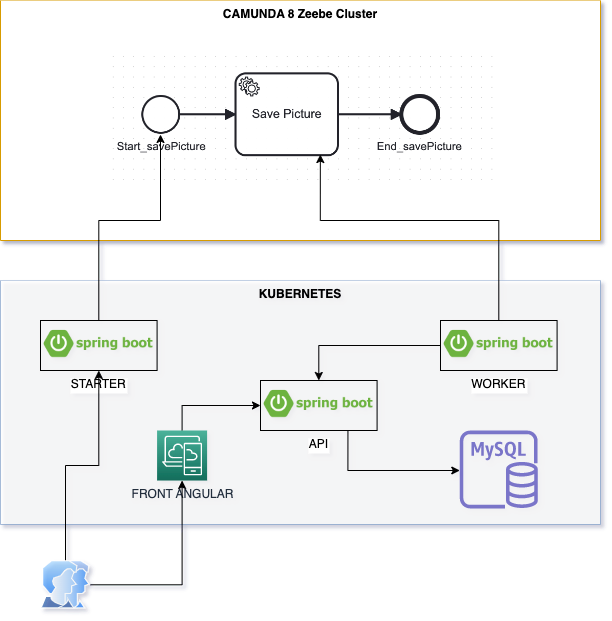

## Running Animal Picture Solution with CAMUNDA 8


1. **Solution Architecture**

[](arquitecture.png)

2. **Java Spring Architecture**

[](clean.png)

## Steps to Run the Spring Boot ( Must have Docker installed )

1. **Clone the solution**

	```bash
    git clone https://github.com/setembrinolusa/camunda8.git
    cd camunda8
	```

2. **Setting up the Cluster vars**

    Change the values as per your Camunda 8 Cluster inside the application.properties files
    
	```bash
    .../camunda8/tree/develop/animal-picture-front/src/main/resources
    .../camunda8/tree/develop/animal-picture-worker/src/main/resources
	```

	```python
	zeebe.client.address= zeebe.camunda.poc
	zeebe.client.id=
	zeebe.client.secret=
	zeebe.client.authorization.server.url=
	zeebe.client.token.audiente=
	```

3. **Running the solution**

    You can run the solution by typing the following command

	```bash
    docker compose up -d
	```

    The servers will start on ports 8080, 8081 and 8082.

    Frontend (STARTER) to start the BPM Process
    
    Go to the <http://localhost:8080/>


    Frontend ANGULAR to see the List of Pictures from MySQL database
    
    Go to the <http://localhost:4200/>


    Worker from-to Camunda 8

    Go to the <http://localhost:8081/>


    Application to persist and search pictures from-to MySQL database

    Go to the <http://localhost:8082/>


4. **Steps to Access the app documentation**

    Go to the <http://localhost:8082/swagger-ui/>


## Database MySQL 5.7

```bash
    MYSQL_DATABASE: pictures_db
    MYSQL_USER: pictures_u
    MYSQL_PASSWORD: pictures_p
    MYSQL_ROOT_PASSWORD: root0808
```

| Tables       | Rows |
|--------------|:----:|
| picture      |  0   |

## Pictures table

```bash
    mysql> mysql -u pictures_u -p
    mysql> Enter password: `pictures_p`
    mysql> use pictures_db;
    mysql> SELECT * FROM pictures_db.picture;
```

| id  | animal_type | data       | name       | path       | type       |
|-----|:-----------:|:----------:|:----------:|:----------:|:----------:|
|     |             |            |            |            |            |


5. **Running a Local Cluster**

	https://docs.camunda.io/docs/self-managed/setup/deploy/local/local-kubernetes-cluster/

	Add local host mapping so you can resolve the domain name 
	that will be used to access the Camunda 8 cluster camunda.poc to the local IP address 127.0.0.1.
 	
 	If you are using Mac or Linux, modify the sudo vi /etc/hosts file. 
 	
 	For Windows, modify c:\Windows\System32\Drivers\etc\hosts. Add the following two lines:
 
```bash
	127.0.0.1 camunda.poc
	127.0.0.1 zeebe.camunda.poc
```

## Create the Cluster

```bash
	kind create cluster --name kind-camunda-platform-poc --config kind.config
	
	kubectl config use-context kind-camunda-platform-poc
	
	kubectl apply -f \
	https://raw.githubusercontent.com/kubernetes/ingress-nginx/main/deploy/static/provider/kind/deploy.yaml
```
	
	The ingress-ngnix controller resources (pods, services, etc.) will be deployed 
	into the ingress-nginx namespace. 
	
	It may take a few minutes to download container images and configure deployments. 
	Make sure all pods are running with the command before continuing
	
```bash
	kubectl get pods --namespace ingress-nginx

	kubectl config use-context kind-camunda-platform-poc
	
	helm repo add camunda https://helm.camunda.io
	
	helm repo update

	helm install --name camunda-platform camunda/camunda-platform \ 
	-f values-combined-ingress.yaml
```

	Once deployed, you can access the Camunda 8 components on:

	Applications: https://camunda.poc/[identity|operate|tasklist|zeebe]

	Keycloak authentication: https://camunda.poc/auth

	Zeebe Gateway: grpc://zeebe.camunda.poc


6. **Install the Solution**

```bash

`Install Mysql`
	
    helm install --name mysql \ 
    --set mysqlRootPassword=root0808,mysqlUser=pictures_u,mysqlPassword=pictures_p,mysqlDatabase=pictures_db \ 
    stable/mysql

`Install animal-picture-app`
	
    cd animal-picture-app
    
    helm install --name animal-picture-app ./animal-picture-app

`Install animal-picture-front`
	
    cd animal-picture-front
    
    helm install --name animal-picture-front ./animal-picture-front

`Install animal-picture-worker`
	
    cd animal-picture-worker
    
    helm install --name animal-picture-worker ./animal-picture-worker

`Install animal-picture-angular`
	
    cd animal-picture-angular
    
    helm install --name animal-picture-angular ./animal-picture-angular

```

7. **The Solution**

	Go to http://camunda.poc/animal-picture-front to Start the Process
	Go to http://camunda.poc/animal-picture-angular to Access the List of Pictures
